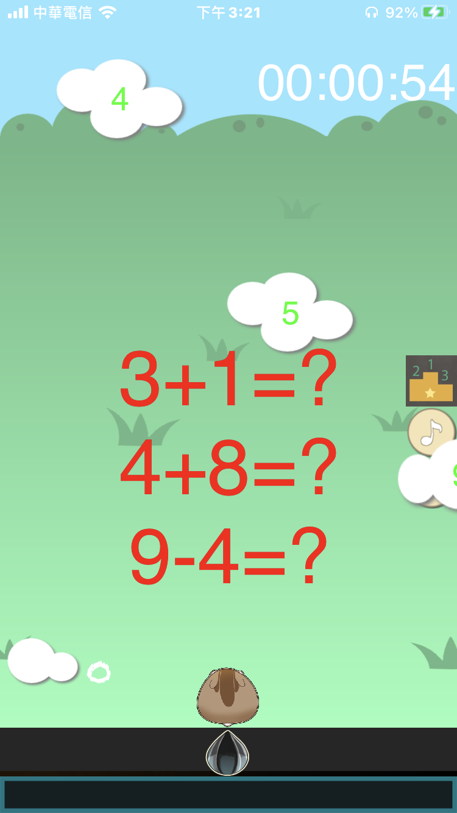

# iOS_Math_Practicing

- iOS_Math_Practicing is a math practicing game in iOS.

## Important!
### You can use the codes to do what ever you want, instead of using the images and musics.

## Description

```
Your children are not interested with math?

Want them to learn math by game?

Want them to upgrade math capability by game?

Play this!

*Infinity Mode
*Breakthrough Mode
*TimeLimit Mode
```

## Screentshots
| Page 01 | Page 02 |
|:--:|:--:|
|||
